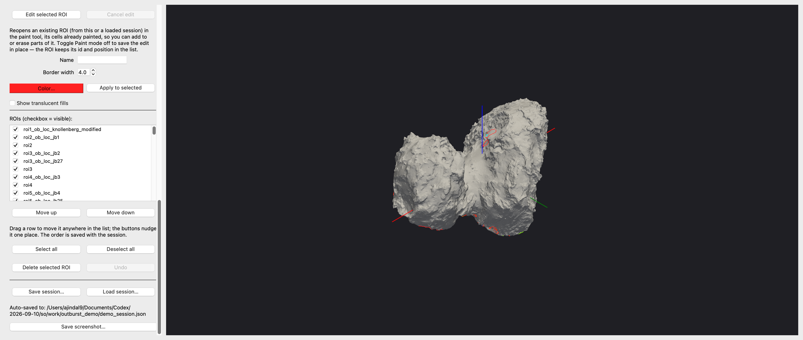
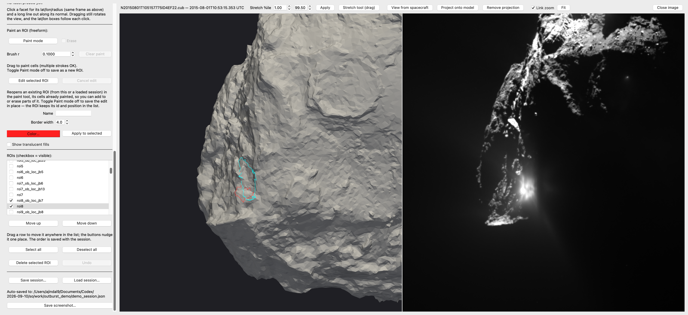
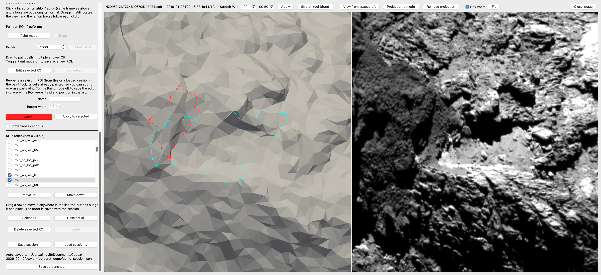
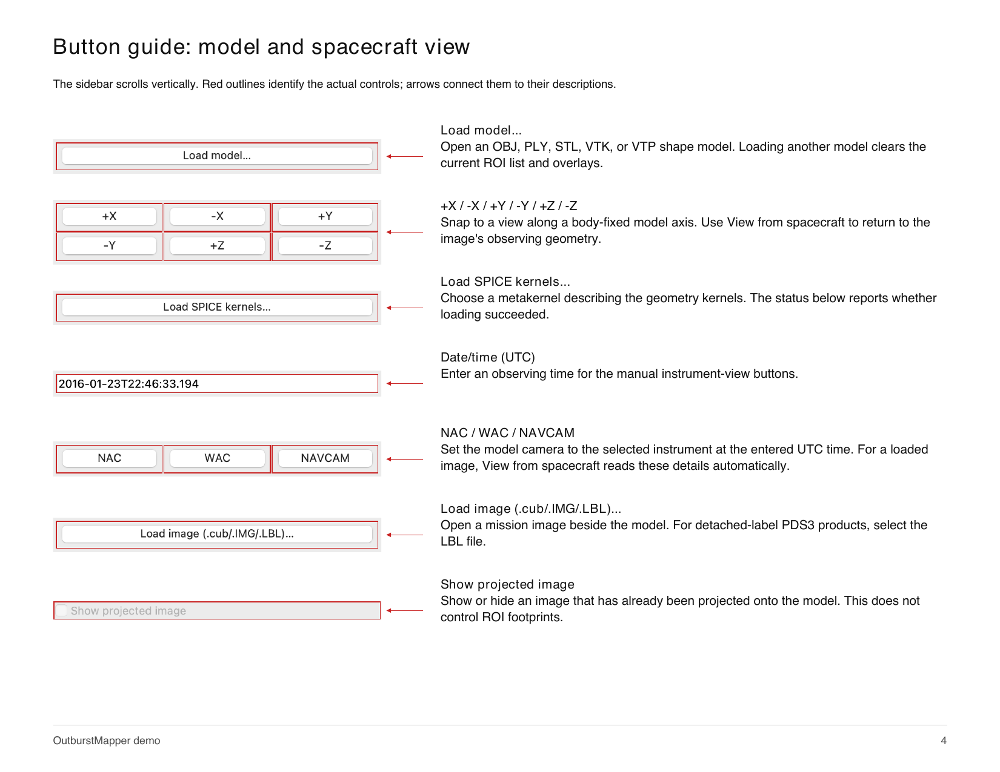
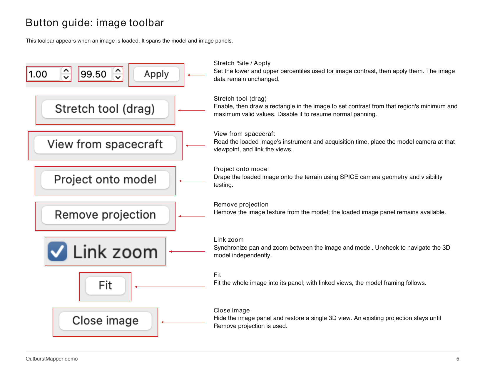
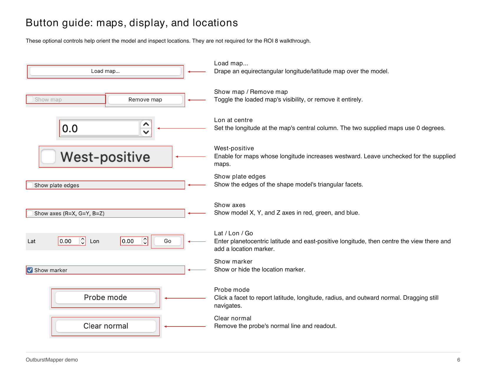
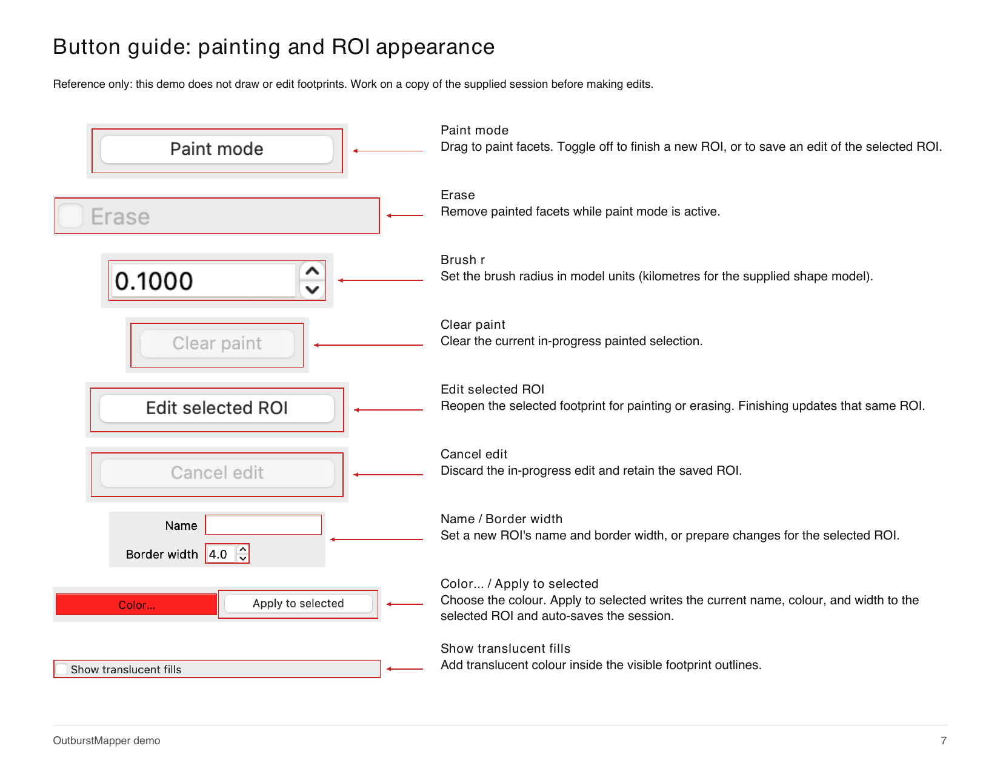
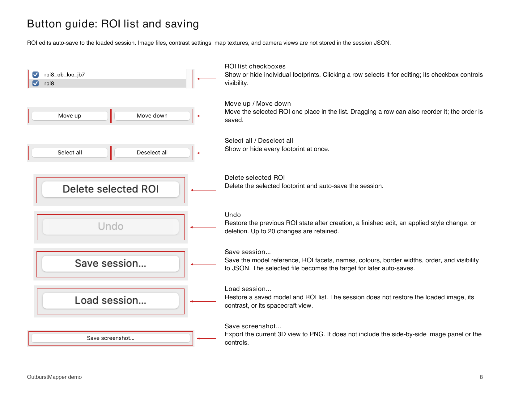

# OutburstMapper demo

[Open the eight-page PDF guide](OutburstMapper-demo.pdf).

This guide walks through loading a saved ROI session, opening outburst and
surface images, and inspecting existing boundaries in spacecraft view with
linked zoom. We use the August 1, 2015 outburst associated with ROI 8 as an
example. The button guide below explains the controls used throughout the app.

ROI 8 is a broader region consisting of several features. Here we focus on
the sub-region associated with the August 1, 2015 outburst, using the existing
footprints.

## 1. Start the app and load the saved session

Follow the [installation instructions](../README.md#installation) and unpack
[the Zenodo data archive](https://doi.org/10.5281/zenodo.22133944) into the
repository's `data/` folder. The model, kernels, session, and image cubes
used below come from that archive.

From the OutburstMapper folder, run:

```bash
python outburst_mapper.py
```

The shape model and SPICE kernels load automatically. Check for
**SPICE: loaded (ROS_OPS.TM)**. Scroll down the left sidebar, click
**Load session...**, and open:

```text
data/sessions/67P_outburst_session.json
```

The session restores all 78 ROI entries. Keep them enabled initially, or
click **Select all**, to inspect the complete set. Rotate the model to see
outlines on other sides.



The list and session controls are at left; the visible outlines depend on
the model viewpoint.

## 2. Keep only the ROI 8 boundaries

Click **Deselect all**, then tick these two entries:

| ROI entry | Boundary |
| --- | --- |
| `roi8_ob_loc_jb7` | August 1, 2015 outburst source (red) |
| `roi8` | Surface-change region (cyan) |

A checkbox controls visibility; clicking a row selects it for editing.
Leave **Show translucent fills** unchecked to reproduce the boundary-only
views below. This walkthrough does not require drawing or editing any ROI.

## 3. Load the outburst image and match the view

Click **Load image (.cub/.IMG/.LBL)...** and choose:

```text
data/ROI_data/roi8/outburst_img/N20150801T105157775ID4EF22.cub
```

Click **View from spacecraft**. Keep **Link zoom** checked, then use the
wheel to zoom and drag to pan toward the ROI 8 outlines to reduce empty
background. The model is on the left and the image is on the right.



**August 1, 2015, 10:53:15.353 UTC.** Both panels use the same spacecraft
geometry and linked framing. The red outline marks the saved August 1
outburst-source footprint; cyan marks the broader surface-change region.

Adjust **Stretch %ile** and **Apply** for contrast; **Fit** returns to the
full image. A footprint is a saved ROI boundary. **Project onto model** is
optional and is not used in these views.

## 4. Load the surface image and compare

Use **Load image...** to open:

```text
data/ROI_data/roi8/surface_img/N20160123T224510679ID4EF24.cub
```

Click **View from spacecraft** again to use this image's own time and
instrument. Keep the same two ROI entries enabled and use linked zoom to
inspect the terrain.



**January 23, 2016, 22:46:33.194 UTC.** The cyan outline shows the saved
surface-change region, with the red August 1 source footprint retained for
comparison. The model is shaded for viewing, so its brightness and shadows
do not reproduce the photograph. These are different observations, not a
before/after image pair. Observation times come from the cube labels and
differ slightly from the timestamps in the filenames.

## 5. Save a view or return later

**Save screenshot...** exports the 3D view only. Capture the whole
application to retain both panels and controls, as in the examples above.

**Save session...** stores the model reference, ROI definitions, names,
colours, border widths, list order, and visibility. Use **Load session...**
to restore them later, then reopen the image and click **View from
spacecraft** again. Image files, contrast settings, map textures, and camera
views are not stored in the session JSON.

ROI edits auto-save to the loaded session. Work on a copy of the supplied
session before changing ROI shapes, names, styles, or order, or deleting
entries.

## Button guide

The following pages identify the actual controls with red outlines and
arrows. Click an image to enlarge it, or use the [PDF guide](OutburstMapper-demo.pdf).
The sidebar scrolls vertically; the image toolbar appears when an image is loaded.

### Model and spacecraft view



### Image toolbar



### Maps, display, and locations



### Painting and ROI appearance

These controls are included for reference. The walkthrough uses existing
footprints and does not require painting or editing.



### ROI list and saving



## Data and image credits

The screenshots show Rosetta/OSIRIS Narrow Angle Camera imagery and the
SHAP7 shape model distributed with the
[OutburstMapper data archive](https://doi.org/10.5281/zenodo.22133944).
Please retain the original mission, instrument, and shape-model credits
when reusing these data. See the repository's [citation guidance](../README.md#citing).
